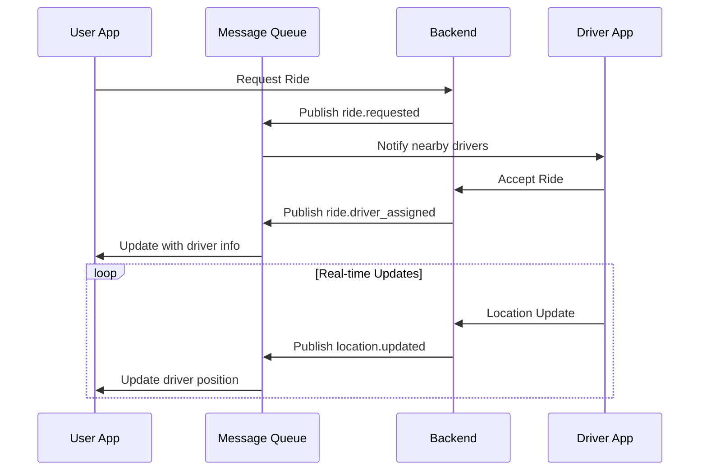

# 🚀 Complete Ride-Hailing App Implementation Guide

## Table of Contents
1. [Architecture Overview](#architecture-overview)
2. [MVVM Implementation](#mvvm-implementation)
3. [Plug-and-Play Infrastructure](#plug-and-play-infrastructure)
4. [Setup Instructions](#setup-instructions)
5. [Configuration Guide](#configuration-guide)
6. [Real-Time Features](#real-time-features)
7. [Load Balancing](#load-balancing)
8. [Message Queues](#message-queues)
9. [Testing Guide](#testing-guide)
10. [Deployment Strategies](#deployment-strategies)
11. [Troubleshooting](#troubleshooting)

---

## Architecture Overview

### 🏗️ **Clean Architecture + MVVM Pattern**

```
📱 Presentation Layer (UI)
├── 🎨 Views (Widgets/Screens)
├── 🧠 ViewModels (State Management)
└── 📊 State Classes

💼 Business Layer (Domain)
├── 🎯 Use Cases (Business Logic)
├── 📋 Entities (Core Models)
└── 🔌 Repository Interfaces

💾 Data Layer
├── 🌐 Remote Data Sources (APIs)
├── 💿 Local Data Sources (Storage)
├── 🏪 Repository Implementations
└── 📦 Models (Data Transfer Objects)

🔧 Core Layer
├── ⚙️ Services (Load Balancer, Message Queue)
├── 🛠️ Configuration
├── ❌ Error Handling
└── 🔗 Dependency Injection
```

### 🎯 **Key Benefits**
- ✅ **Separation of Concerns**: Each layer has a single responsibility
- ✅ **Testability**: Easy to unit test each component
- ✅ **Scalability**: Plug-and-play infrastructure components
- ✅ **Maintainability**: Clear code organization and dependencies
- ✅ **Flexibility**: Easy to swap implementations

---

## MVVM Implementation

### 📱 **User App Structure**

#### **1. Entities (Business Models)**
```dart
// lib/features/ride/business/entities/ride_entity.dart
class RideEntity extends Equatable {
  final String id;
  final RideStatus status;
  final RideType type;
  final DateTime requestedAt;
  final double fareAmount;
  // ... complete ride information
}

enum RideStatus {
  requested, accepted, driverEnRoute, 
  arrived, inProgress, completed, cancelled
}

enum RideType { economy, comfort, premium }
```

#### **2. Use Cases (Business Logic)**
```dart
// lib/features/ride/business/usecases/request_ride_usecase.dart
class RequestRideUseCase {
  final RideRepository repository;
  
  Future<Either<Failure, RideEntity>> call(RequestRideParams params) async {
    return await repository.requestRide(/* parameters */);
  }
}
```

#### **3. ViewModels (State Management)**
```dart
// lib/features/ride/presentation/viewmodels/ride_booking_viewmodel.dart
class RideBookingViewModel extends ChangeNotifier {
  // State management for entire booking flow
  BookingState _state = BookingState.initial;
  RideEntity? _currentRide;
  
  // Business logic delegation
  Future<void> requestRide() async {
    final result = await _requestRideUseCase.call(params);
    // Handle result and update UI state
  }
}
```

#### **4. Views (UI Components)**
```dart
// lib/features/ride/presentation/pages/ride_booking_screen_mvvm.dart
class RideBookingScreenMVVM extends StatefulWidget {
  @override
  Widget build(BuildContext context) {
    return Consumer<RideBookingViewModel>(
      builder: (context, viewModel, child) {
        // UI updates automatically based on viewModel state
        return _buildBody(context, viewModel);
      },
    );
  }
}
```

### 🚗 **Driver App Structure**

#### **Driver-Specific Entities**
```dart
// lib/features/ride/business/entities/ride_request_entity.dart
class RideRequestEntity extends Equatable {
  final String id;
  final String userId;
  final DateTime expiresAt;
  final RideRequestStatus status;
  final double distanceFromDriver;
  // ... request details
}
```

#### **Driver ViewModel**
```dart
// lib/features/ride/presentation/viewmodels/driver_ride_viewmodel.dart
class DriverRideViewModel extends ChangeNotifier {
  DriverRideState _state = DriverRideState.offline;
  List<RideRequestEntity> _pendingRequests = [];
  
  Future<void> acceptRequest(String requestId) async {
    // Handle ride request acceptance
  }
}
```

---

## Plug-and-Play Infrastructure

### 🔌 **Zero-Code Configuration**

#### **Method 1: Environment Variables**
```bash
# .env file
ENABLE_LOAD_BALANCER=true
ENABLE_MESSAGE_QUEUE=true
MESSAGE_QUEUE_TYPE=redis
LOAD_BALANCER_STRATEGY=leastConnections
PRODUCTION=false
```

#### **Method 2: Configuration Class**
```dart
// lib/core/config/app_config.dart
class AppConfig {
  static const bool enableLoadBalancer = bool.fromEnvironment('ENABLE_LOAD_BALANCER', defaultValue: false);
  static const bool enableMessageQueue = bool.fromEnvironment('ENABLE_MESSAGE_QUEUE', defaultValue: false);
  static const String messageQueueType = String.fromEnvironment('MESSAGE_QUEUE_TYPE', defaultValue: 'redis');
}
```

#### **Method 3: Runtime Configuration**
```dart
// lib/main.dart
void main() async {
  await di.init(
    enableLoadBalancer: true,
    enableMessageQueue: true,
    loadBalancerStrategy: LoadBalancerStrategy.leastConnections,
    messageQueueType: 'redis',
  );
}
```

### 🔄 **Dependency Injection Setup**
```dart
// lib/core/di/injection_container.dart
Future<void> init({
  bool enableLoadBalancer = false,
  bool enableMessageQueue = false,
  LoadBalancerStrategy loadBalancerStrategy = LoadBalancerStrategy.roundRobin,
  String messageQueueType = 'redis',
}) async {
  // Optional services - only registered if enabled
  if (enableLoadBalancer) {
    sl.registerLazySingleton<LoadBalancerService>(() => /* setup */);
  }
  
  if (enableMessageQueue) {
    sl.registerLazySingleton<MessageQueueService>(() => /* setup */);
  }
  
  // Core services always registered
  sl.registerFactory(() => RideBookingViewModel(
    messageQueue: enableMessageQueue ? sl<MessageQueueService>() : null,
  ));
}
```

---

## Setup Instructions

### 📋 **Prerequisites**
- Flutter SDK 3.8.1+
- Dart 3.0+
- Laravel 12.0+ (Backend)
- Redis/RabbitMQ (Optional - for message queues)
- Load Balancer (Optional - Nginx, HAProxy, or cloud LB)

### 🚀 **Quick Start**

#### **1. Clone and Setup Flutter Apps**
```bash
# User App
cd flutter/user
flutter pub get

# Driver App  
cd flutter/driver
flutter pub get
```

#### **2. Backend Setup**
```bash
cd laravel
composer install
cp .env.example .env
php artisan key:generate
php artisan migrate
php artisan db:seed
```

#### **3. Configuration**
```bash
# Create environment configuration
echo "ENABLE_LOAD_BALANCER=false" >> .env
echo "ENABLE_MESSAGE_QUEUE=false" >> .env
echo "MESSAGE_QUEUE_TYPE=redis" >> .env
```

#### **4. Run Applications**
```bash
# Backend
php artisan serve --host=0.0.0.0 --port=8000

# User App
cd flutter/user && flutter run

# Driver App
cd flutter/driver && flutter run
```

---

## Configuration Guide

### ⚙️ **Basic Configuration (Single Server)**
```dart
// For development/testing
await di.init(
  enableLoadBalancer: false,    // Single server
  enableMessageQueue: false,    // Polling instead of real-time
);
```

### 🔄 **Load Balanced Configuration**
```dart
// For staging/production
await di.init(
  enableLoadBalancer: true,
  loadBalancerStrategy: LoadBalancerStrategy.leastConnections,
  enableMessageQueue: true,
  messageQueueType: 'redis',
);
```

### 🌍 **Multi-Region Configuration**
```dart
// For global deployment
await di.init(
  enableLoadBalancer: true,
  loadBalancerStrategy: LoadBalancerStrategy.geographicProximity,
  enableMessageQueue: true,
  messageQueueType: 'rabbitmq',
);
```

### 🎛️ **Feature Flags**
```dart
// lib/core/config/app_config.dart
static const Map<String, bool> featureFlags = {
  'surge_pricing': bool.fromEnvironment('FEATURE_SURGE_PRICING', defaultValue: false),
  'ride_sharing': bool.fromEnvironment('FEATURE_RIDE_SHARING', defaultValue: false),
  'scheduled_rides': bool.fromEnvironment('FEATURE_SCHEDULED_RIDES', defaultValue: false),
};

// Usage in code
if (AppConfig.isFeatureEnabled('surge_pricing')) {
  // Show surge pricing UI
}
```

---

## Real-Time Features

### 📡 **Message Queue Integration**

#### **Automatic Event Handling**
```dart
// Your ViewModel automatically receives these events:
'ride.driver_assigned'        → Updates UI with driver info
'ride.driver_location_update' → Updates driver position on map  
'ride.status_changed'         → Updates ride status
'ride.cancelled'             → Shows cancellation message
```

#### **Publishing Events**
```dart
// Automatic event publishing for analytics
messageQueue?.publish('ride.requested', {
  'ride_id': ride.id,
  'user_id': ride.userId,
  'timestamp': DateTime.now().toIso8601String(),
});
```

#### **Subscribing to Events**
```dart
// Automatic subscription management
_messageQueue?.subscribe('ride.${ride.id}');
// Automatically unsubscribes when ride completes
```

### 🎯 **Real-Time State Updates**

#### **Driver Location Tracking**
```dart
void _handleDriverLocationUpdate(Map<String, dynamic> event) {
  final latitude = (event['latitude'] as num?)?.toDouble();
  final longitude = (event['longitude'] as num?)?.toDouble();
  final eta = event['eta_minutes'] as int?;
  
  if (latitude != null && longitude != null && _currentRide != null) {
    _currentRide = _currentRide!.copyWith(
      currentDriverLatitude: latitude,
      currentDriverLongitude: longitude,
      estimatedArrivalMinutes: eta,
    );
    notifyListeners(); // UI updates automatically
  }
}
```

#### **Ride Status Changes**
```dart
void _handleRideStatusChanged(Map<String, dynamic> event) {
  final statusString = event['status'] as String?;
  if (statusString != null && _currentRide != null) {
    final status = _parseRideStatus(statusString);
    _currentRide = _currentRide!.copyWith(status: status);
    _updateStateBasedOnRideStatus(status); // UI transitions automatically
  }
}
```

---

## Load Balancing

### ⚖️ **Supported Strategies**

#### **1. Round Robin**
```dart
LoadBalancerStrategy.roundRobin
// Distributes requests evenly across all servers
// Best for: Equal server capacity
```

#### **2. Least Connections**
```dart
LoadBalancerStrategy.leastConnections  
// Routes to server with fewest active connections
// Best for: Varying request processing times
```

#### **3. Weighted Distribution**
```dart
LoadBalancerStrategy.weighted
// Distributes based on server weights
// Best for: Different server capacities
```

#### **4. Geographic Proximity**
```dart
LoadBalancerStrategy.geographicProximity
// Routes to nearest server based on region
// Best for: Global deployments
```

### 🏥 **Health Monitoring**

#### **Automatic Health Checks**
```dart
// Runs every 60 seconds automatically
await loadBalancer.performHealthChecks();

// Health check endpoint: GET /health
// Expected response: 200 OK
```

#### **Server Statistics**
```dart
final stats = loadBalancer.getStats();
// Returns:
{
  "total_servers": 3,
  "healthy_servers": 2,
  "total_connections": 45,
  "servers": [
    {
      "url": "https://api1.yourapp.com",
      "healthy": true,
      "connections": 15,
      "weight": 3,
      "region": "us-east"
    }
  ]
}
```

### 🔄 **Dynamic Server Management**
```dart
// Add server without restart
loadBalancer.addServer(ServerEndpoint(
  url: 'https://api4.yourapp.com',
  weight: 2,
  region: 'asia-east',
));

// Remove unhealthy server
loadBalancer.removeServer('https://api1.yourapp.com');
```

---

## Message Queues

### 📨 **Supported Technologies**

#### **Redis Pub/Sub**
```dart
// Fast, in-memory messaging
messageQueueType: 'redis'

// Configuration
{
  "url": "redis://localhost:6379",
  "channels": ["ride.*", "user.*", "driver.*"]
}
```

#### **RabbitMQ**
```dart
// Enterprise-grade queuing
messageQueueType: 'rabbitmq'

// Configuration  
{
  "url": "amqp://localhost:5672",
  "queues": ["ride_requests", "location_updates", "notifications"]
}
```

#### **WebSocket**
```dart
// Real-time browser communication
messageQueueType: 'websocket'

// Configuration
{
  "url": "wss://ws.yourapp.com",
  "rooms": ["ride_123", "driver_456"]
}
```

### 🔄 **Technology Switching**
```dart
// Switch from Redis to RabbitMQ - Zero code changes!
await di.init(
  messageQueueType: 'rabbitmq', // Changed from 'redis'
);

// Your ViewModels continue working without modification
```

### 📡 **Event Flow**


---

## Testing Guide

### 🧪 **Unit Testing**

#### **ViewModel Testing**
```dart
// test/viewmodels/ride_booking_viewmodel_test.dart
testWidgets('should request ride successfully', (tester) async {
  // Arrange
  final mockUseCase = MockRequestRideUseCase();
  final viewModel = RideBookingViewModel(
    requestRideUseCase: mockUseCase,
    // ... other dependencies
  );
  
  when(mockUseCase.call(any)).thenAnswer((_) async => Right(mockRide));
  
  // Act
  await viewModel.requestRide();
  
  // Assert
  expect(viewModel.state, BookingState.rideRequested);
  expect(viewModel.currentRide, isNotNull);
});
```

#### **Use Case Testing**
```dart
// test/usecases/request_ride_usecase_test.dart
test('should return ride when repository call is successful', () async {
  // Arrange
  final mockRepository = MockRideRepository();
  final useCase = RequestRideUseCase(mockRepository);
  
  when(mockRepository.requestRide(any)).thenAnswer((_) async => Right(mockRide));
  
  // Act
  final result = await useCase.call(mockParams);
  
  // Assert
  expect(result, Right(mockRide));
});
```

### 🔗 **Integration Testing**

#### **Load Balancer Testing**
```dart
test('should distribute requests across servers', () async {
  final loadBalancer = LoadBalancerService(strategy: LoadBalancerStrategy.roundRobin);
  loadBalancer.addServers([server1, server2, server3]);
  
  final servers = <ServerEndpoint>[];
  for (int i = 0; i < 9; i++) {
    servers.add(loadBalancer.getNextServer()!);
  }
  
  // Should distribute evenly: 3 requests per server
  expect(servers.where((s) => s.url == server1.url).length, 3);
  expect(servers.where((s) => s.url == server2.url).length, 3);
  expect(servers.where((s) => s.url == server3.url).length, 3);
});
```

#### **Message Queue Testing**
```dart
test('should receive published messages', () async {
  final messageQueue = RedisMessageQueueService();
  await messageQueue.connect();
  await messageQueue.subscribe('test.channel');
  
  final receivedMessages = <Map<String, dynamic>>[];
  messageQueue.messageStream.listen(receivedMessages.add);
  
  await messageQueue.publish('test.channel', {'type': 'test', 'data': 'hello'});
  
  await Future.delayed(Duration(milliseconds: 100));
  expect(receivedMessages.length, 1);
  expect(receivedMessages.first['type'], 'test');
});
```

### 🚀 **Load Testing**

#### **Concurrent Ride Requests**
```dart
test('should handle 100 concurrent ride requests', () async {
  final futures = List.generate(100, (i) => 
    rideRepository.requestRide(RequestRideParams(/* params */))
  );
  
  final results = await Future.wait(futures);
  final successful = results.where((r) => r.isRight()).length;
  
  expect(successful, greaterThan(95)); // 95% success rate
});
```

#### **Load Balancer Performance**
```dart
test('should maintain performance under load', () async {
  final loadBalancer = LoadBalancerService(strategy: LoadBalancerStrategy.leastConnections);
  loadBalancer.addServers(servers);
  
  final stopwatch = Stopwatch()..start();
  
  for (int i = 0; i < 10000; i++) {
    loadBalancer.getNextServer();
  }
  
  stopwatch.stop();
  expect(stopwatch.elapsedMilliseconds, lessThan(1000)); // < 1 second for 10k requests
});
```

---

## Deployment Strategies

### 🚀 **Development Environment**
```yaml
# docker-compose.dev.yml
version: '3.8'
services:
  app:
    build: .
    environment:
      - ENABLE_LOAD_BALANCER=false
      - ENABLE_MESSAGE_QUEUE=false
      - PRODUCTION=false
    ports:
      - "8000:8000"
```

### 🎯 **Staging Environment**
```yaml
# docker-compose.staging.yml
version: '3.8'
services:
  app:
    build: .
    environment:
      - ENABLE_LOAD_BALANCER=true
      - ENABLE_MESSAGE_QUEUE=true
      - MESSAGE_QUEUE_TYPE=redis
      - LOAD_BALANCER_STRATEGY=roundRobin
    ports:
      - "8000:8000"
  
  redis:
    image: redis:alpine
    ports:
      - "6379:6379"
```

### 🌍 **Production Environment**
```yaml
# docker-compose.prod.yml
version: '3.8'
services:
  app:
    build: .
    environment:
      - ENABLE_LOAD_BALANCER=true
      - ENABLE_MESSAGE_QUEUE=true
      - MESSAGE_QUEUE_TYPE=rabbitmq
      - LOAD_BALANCER_STRATEGY=geographicProximity
      - PRODUCTION=true
    deploy:
      replicas: 3
  
  rabbitmq:
    image: rabbitmq:management
    environment:
      - RABBITMQ_DEFAULT_USER=admin
      - RABBITMQ_DEFAULT_PASS=password
  
  nginx:
    image: nginx:alpine
    ports:
      - "80:80"
      - "443:443"
```

### ☁️ **Cloud Deployment (AWS)**
```yaml
# kubernetes/deployment.yml
apiVersion: apps/v1
kind: Deployment
metadata:
  name: ride-hailing-app
spec:
  replicas: 5
  selector:
    matchLabels:
      app: ride-hailing-app
  template:
    metadata:
      labels:
        app: ride-hailing-app
    spec:
      containers:
      - name: app
        image: your-registry/ride-hailing-app:latest
        env:
        - name: ENABLE_LOAD_BALANCER
          value: "true"
        - name: ENABLE_MESSAGE_QUEUE
          value: "true"
        - name: MESSAGE_QUEUE_TYPE
          value: "redis"
        - name: REDIS_URL
          value: "redis://elasticache.amazonaws.com:6379"
```

---

## Troubleshooting

### 🔧 **Common Issues**

#### **1. Load Balancer Not Working**
```dart
// Check if load balancer is enabled
if (!AppConfig.enableLoadBalancer) {
  print('Load balancer is disabled in configuration');
}

// Check server health
final stats = loadBalancer.getStats();
print('Healthy servers: ${stats['healthy_servers']}/${stats['total_servers']}');

// Manual health check
await loadBalancer.performHealthChecks();
```

#### **2. Message Queue Connection Issues**
```dart
// Check connection status
try {
  await messageQueue.connect();
  print('Message queue connected successfully');
} catch (e) {
  print('Message queue connection failed: $e');
}

// Test message publishing
try {
  await messageQueue.publish('test.channel', {'test': 'data'});
  print('Message published successfully');
} catch (e) {
  print('Message publishing failed: $e');
}
```

#### **3. Real-Time Updates Not Working**
```dart
// Check if message queue is enabled
if (_messageQueue == null) {
  print('Message queue is not enabled - real-time updates disabled');
}

// Check subscription status
print('Subscribed channels: ${_messageQueue?.subscribedChannels}');

// Check event handling
void _handleMessageQueueEvent(Map<String, dynamic> event) {
  print('Received event: $event');
  // ... handle event
}
```

### 📊 **Performance Monitoring**

#### **Load Balancer Metrics**
```dart
// Monitor request distribution
final stats = loadBalancer.getStats();
for (final server in stats['servers']) {
  print('Server: ${server['url']}');
  print('  Connections: ${server['connections']}');
  print('  Healthy: ${server['healthy']}');
  print('  Response Time: ${server['avg_response_time']}ms');
}
```

#### **Message Queue Metrics**
```dart
// Monitor message throughput
final metrics = messageQueue.getMetrics();
print('Messages sent: ${metrics['messages_sent']}');
print('Messages received: ${metrics['messages_received']}');
print('Connection status: ${metrics['connection_status']}');
```

### 🚨 **Error Handling**

#### **Graceful Degradation**
```dart
// If load balancer fails, fall back to single server
String _getServerUrl() {
  if (loadBalancer != null) {
    final server = loadBalancer!.getNextServer();
    if (server != null) {
      return server.url;
    }
  }
  // Fallback to default server
  return ApiConfig.baseUrl;
}

// If message queue fails, fall back to polling
void _initializeRealTimeUpdates() {
  if (_messageQueue != null) {
    _setupMessageQueueUpdates();
  } else {
    _setupPollingUpdates(); // Fallback mechanism
  }
}
```

---

## 📚 **Quick Reference**

### 🔧 **Configuration Commands**
```bash
# Enable load balancer
export ENABLE_LOAD_BALANCER=true

# Enable message queue
export ENABLE_MESSAGE_QUEUE=true

# Set message queue type
export MESSAGE_QUEUE_TYPE=redis

# Enable feature flags
export FEATURE_SURGE_PRICING=true
```

### 📱 **Key Files**
- `lib/main.dart` - App initialization
- `lib/core/config/app_config.dart` - Configuration
- `lib/core/di/injection_container.dart` - Dependency injection
- `lib/core/services/load_balancer_service.dart` - Load balancing
- `lib/core/services/message_queue_service.dart` - Real-time messaging
- `lib/features/ride/presentation/viewmodels/ride_booking_viewmodel.dart` - Ride booking logic

### 🚀 **Deployment Checklist**
- [ ] Configure environment variables
- [ ] Set up load balancer endpoints
- [ ] Configure message queue connection
- [ ] Enable health checks
- [ ] Set up monitoring
- [ ] Test failover scenarios
- [ ] Verify real-time updates
- [ ] Load test the system

---

**🎉 Congratulations!** You now have a complete, scalable, plug-and-play ride-hailing app architecture that can handle thousands of concurrent users with real-time updates and automatic load balancing!